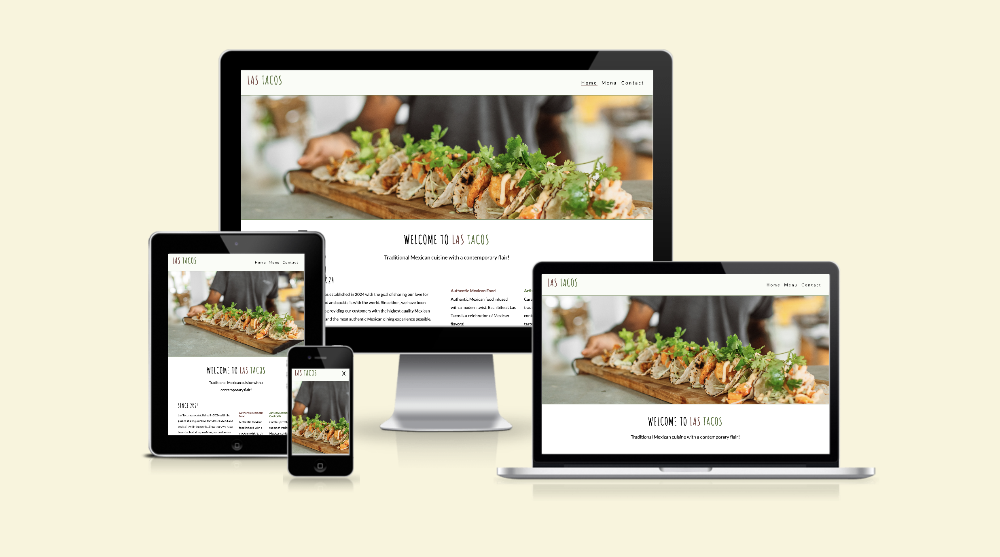

# Las Tacos

Las Tacos is a fictional Mexican restaurant located in the heart of Cork city. Las Tacos offers an authentic Mexican dining experience. The food is a modern twist on time-honoured recipes. The cocktails are a fusion of traditional Mexican spirits and contemporary flavours.

The purpose of this website is to promote Las Tacos and to provide information to customers about the restaurant, its menu and contact options. The website targets an audience of customers who enjoy Mexican food in a causal dining experience.

Visit the deployed website [here](https://alvor1991.github.io/Las-Tacos-PP1/).

## Table of Contents

1. [User Experience (UX)](#user-experience-ux)
    1. [Project Goals](#project-goals)
    2. [User Stories](#user-stories)
    3. [Color Scheme](#color-scheme)
    4. [Typography](#typography)
    5. [Wireframes](#wireframes)
2. [Features](#features)
    1. [General](#general)
    2. [Landing Page](#landing-page)
    3. [Treatments Page](#treatments-page)
    4. [Book Now Page](#book-now-page)
    5. [404 Error Page](#404-error-page)
 3. [Technologies Used](#technologies-used)
    1. [Languages Used](#languages-used)
    2. [Frameworks, Libraries and Programs Used](#frameworks-libraries-and-programs-used)
4. [Testing](#testing)
    1. [Testing User Stories](#testing-user-stories)
    2. [Code Validation](#code-validation)
    3. [Accessibility](#accessibility)
    4. [Tools Testing](#tools-testing)
    5. [Manual Testing](#manual-testing)
5. [Finished Product](#finished-product)
6. [Deployment](#deployment)
    1. [GitHub Pages](#github-pages)
7. [Credits](#credits)
    1. [Content](#content)
    2. [Media](#media)
    3. [Code](#code)
8. [Acknowledgements](#acknowledgements)

***

## User Experience (UX)

### Project Goals

* Showcase Mexican cuisine - highlight the rich and diverse flavors of Mexican cuisine through engaging visuals and descriptions.

* Provide a seamless user experience - design an intuitive and user-friendly website structure with easy navigation between pages. 

* Encourage customer engagement - include clear calls-to-action, inviting visitors to explore the menu, make reservations or get in touch. 

* Generate interest and drive traffic - optimize the website for search engines to increase visibility and attract customers. 

### User Stories

* As a customer, I want to be able to navigate the website intuitively and learn more about the restaurant.

* As a customer, I want to be able to read more about the food and cocktail options available.

* As a customer, I want to easily find the contact information for the business.

* As a customer, I want to find social media links to the business.

* As a customer, I want to be able to book a reservation directly from the website.

* As a customer, I want to easily find the business' location.
