# Las Tacos

Las Tacos is a fictional Mexican restaurant located in the heart of Cork city. Las Tacos offers an authentic Mexican dining experience. The food is a modern twist on time-honoured recipes. The cocktails are a fusion of traditional Mexican spirits and contemporary flavours.

The purpose of this website is to promote Las Tacos and to provide information to customers about the restaurant, its menu and contact options. The website targets an audience of customers who enjoy Mexican food in a causal dining experience.

Visit the deployed website [here](https://alvor1991.github.io/Las-Tacos-PP1/).

## Table of Contents

1. [User Experience (UX)](#user-experience-ux)
    1. [Project Goals](#project-goals)
    2. [User Stories](#user-stories)
    3. [Color Scheme](#color-scheme)
    4. [Typography](#typography)
    5. [Wireframes](#wireframes)
2. [Features](#features)
    1. [General](#general)
    2. [Landing Page](#landing-page)
    3. [Treatments Page](#treatments-page)
    4. [Book Now Page](#book-now-page)
    5. [404 Error Page](#404-error-page)
 3. [Technologies Used](#technologies-used)
    1. [Languages Used](#languages-used)
    2. [Frameworks, Libraries and Programs Used](#frameworks-libraries-and-programs-used)
4. [Testing](#testing)
    1. [Testing User Stories](#testing-user-stories)
    2. [Code Validation](#code-validation)
    3. [Accessibility](#accessibility)
    4. [Tools Testing](#tools-testing)
    5. [Manual Testing](#manual-testing)
5. [Finished Product](#finished-product)
6. [Deployment](#deployment)
    1. [GitHub Pages](#github-pages)
7. [Credits](#credits)
    1. [Content](#content)
    2. [Media](#media)
    3. [Code](#code)
8. [Acknowledgements](#acknowledgements)

***

## User Experience (UX)

### Project Goals

* Showcase Mexican cuisine - highlight the rich and diverse flavors of Mexican cuisine through engaging visuals and descriptions.

* Provide a seamless user experience - design an intuitive and user-friendly website structure with easy navigation between pages. 

* Encourage customer engagement - include clear calls-to-action, inviting visitors to explore the menu, make reservations or get in touch. 

* Generate interest and drive traffic - optimize the website for search engines to increase visibility and attract customers. 

### User Stories

* As a customer, I want to be able to navigate the website intuitively and learn more about the restaurant.

* As a customer, I want to be able to read more about the food and cocktail options available.

* As a customer, I want to easily find the contact information for the business.

* As a customer, I want to find social media links to the business.

* As a customer, I want to be able to book a reservation directly from the website.

* As a customer, I want to easily find the business' location.

### Color Scheme
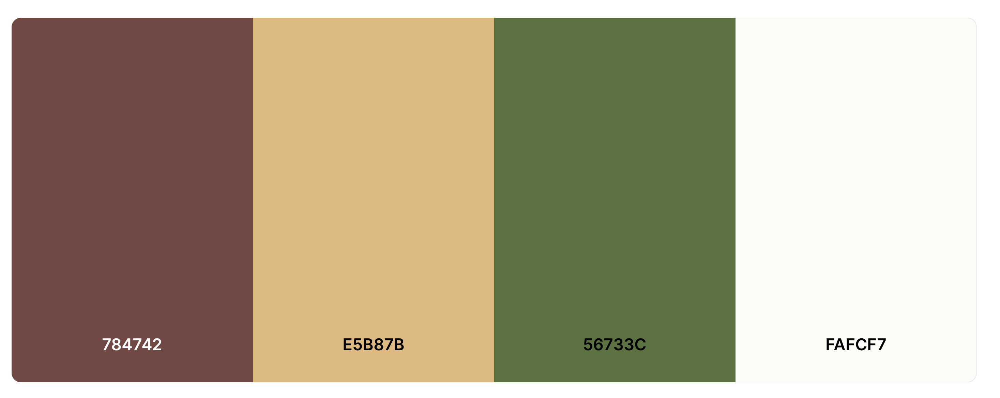

The colors used in the site are red (#784742), yellow (#E5B87B), two shades of green (#56733C and #FAFCF7) and the colour white for the main background. These colours represent Cinco de Mayo, a celebration of Mexico. I recreated the Mexican flag in the navigation bar and footer elements. A shade of gold is used instead of white, as I wanted the colour to stand out more against a light clean background. For the menu section, the left side is red and the right side is green, consistent with the Las Tacos logo. The desserts heading is in gold to give the menu the complete colour selection and highlight desserts as an indulgent and luxury item.

### Typography

I want the site to have both an authentic and modern feel. Amatic SC is used for the headings, which gives the site a friendly and informal vibe. It evokes a sense of traditional Mexican art, adding a touch of authenticity to the site. It is also used for the logo, reinforcing the Las Tacos brand. The main font used in the site is Lato, with Sans Serif as the fallback font in case Lato is not being imported correctly. The combination of Amatic SC and Lato creates a cohesive visual identity. 

### Wireframes

[Balsamiq](https://balsamiq.com/) has been used to showcase the appearance of the site and display the placement of the different elements whitin the pages.

Page | Desktop Version | Mobile Version
--- | --- | ---
Index | 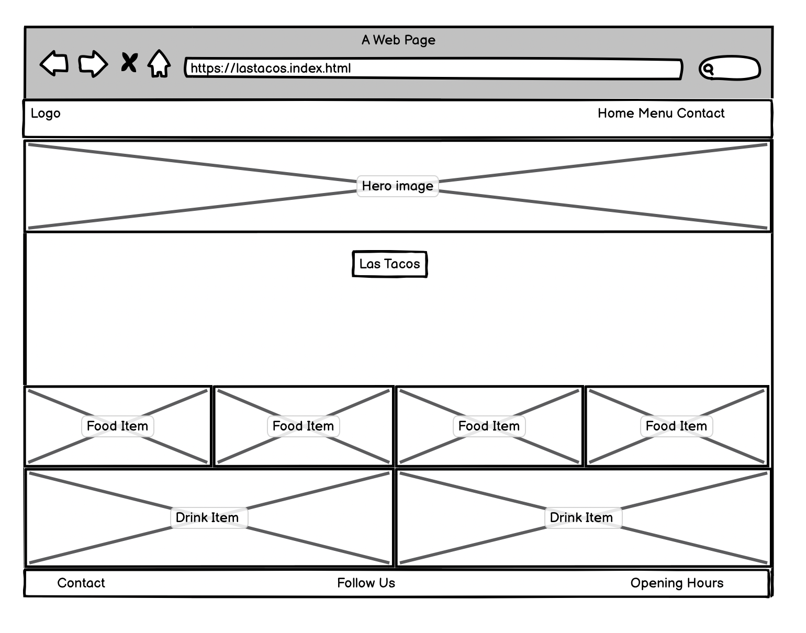 | 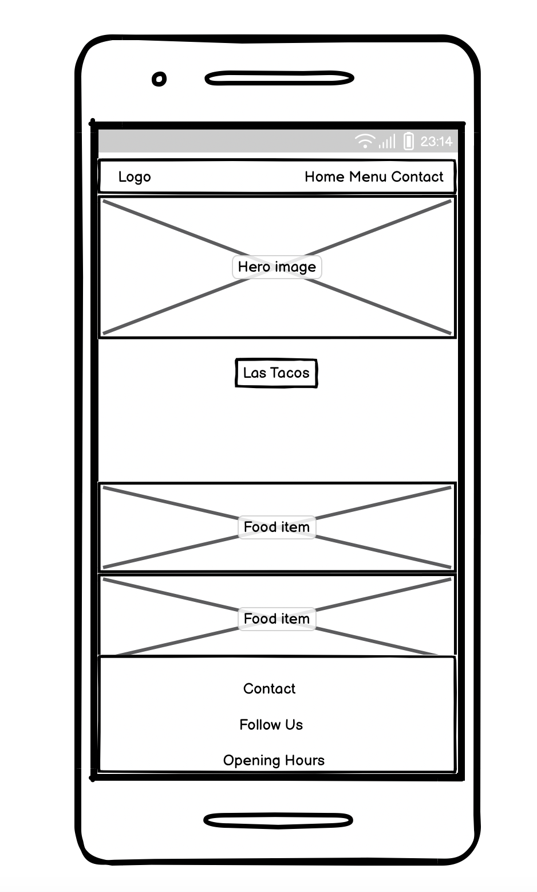
Menu | 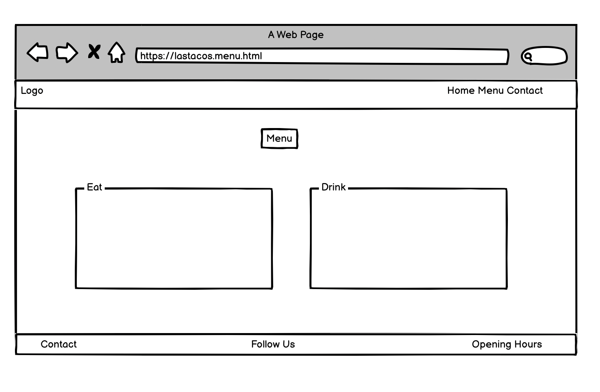 | 
Contact | 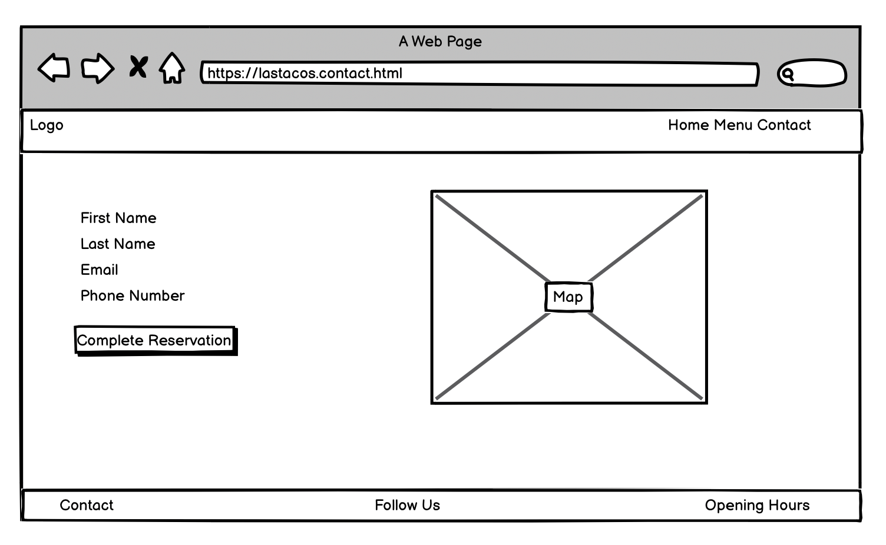 | 

[Back to top ⇧](#las-tacos)

## Features

### General

* Responsive design across all device sizes.

* Similar color scheme and design throughout all pages to effectively structure, categorise and present the information to customers.

* **Header**
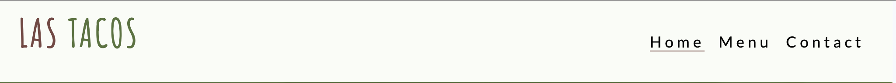
    
    - The header contains the business logo and fully responsive navigation bar positioned across the top of the screen.

    - The business logo functions as a link to the landing page.

    - The navigation bar is identical in all pages and contains links to all pages to facilitate navigation across the site. It also has a hover effect that changes color to provide feedback to the customer for a better user experience.

* **Footer**
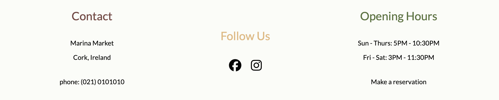

    - The footer includes a smaller version of the logo and link to the business' social media channels.

### Landing Page

* **Hero Image**
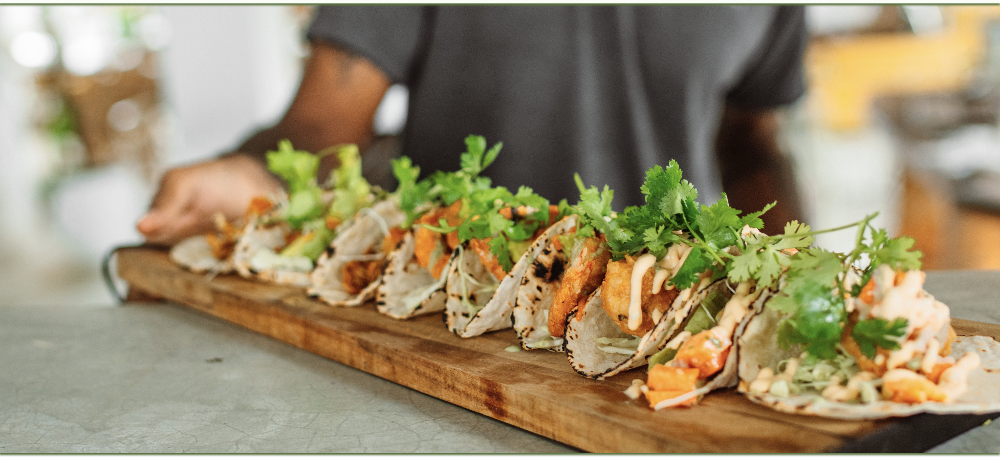

    - The hero image is designed to attract the customer's attention with a fresh and modern ingredients.

* **Info Section**

    - Contains a welcome heading and welcome statement. This section communicates the essence of the site and entices customers to explore more about the unique culinary offerings.

* **Intro Section**
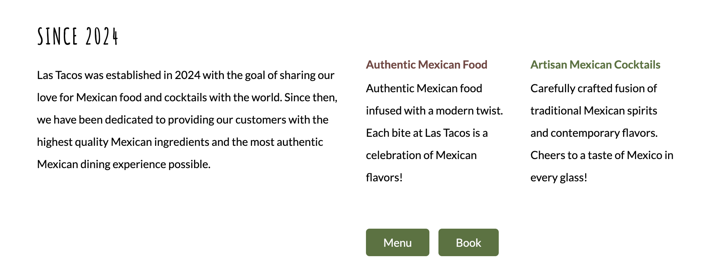

    - Provides a glimpse into the history, mission, and the unique experience that the business offers. It also provides an option to book a reservation or view the food and cocktails menu. 

* **Image Section**
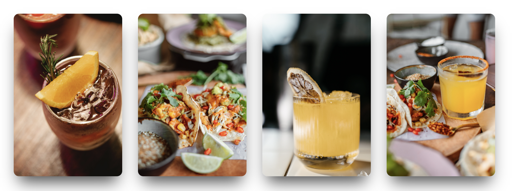

    - Contains images, giving the customer a taste of what Mexican food and cocktails the business has to offer. Each image is fully responsive and provides a link to the menu page.

### Menu Page

* **Food Section**
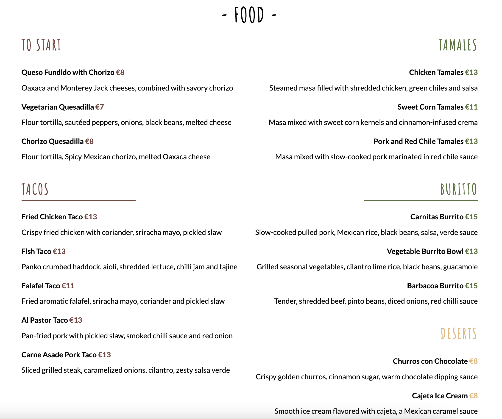

    - This section provides customers with all the food items available.  

    - The food section is fully responsive and easy to replicate in case more food items need to be added.

* **Cocktail Section**
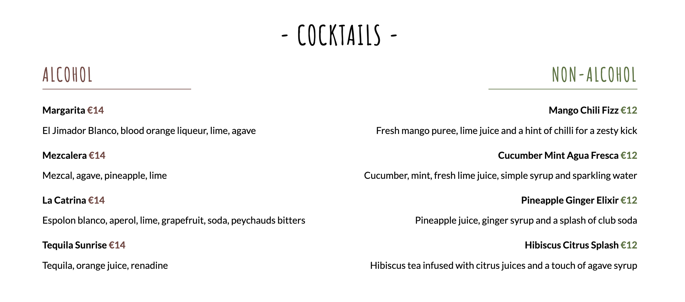

    - This section provides customers with all the cocktails items available.  

    - The food section is fully responsive and easy to replicate in case more cocktail items need to be added.

### Contact Page

* **Contact Section**
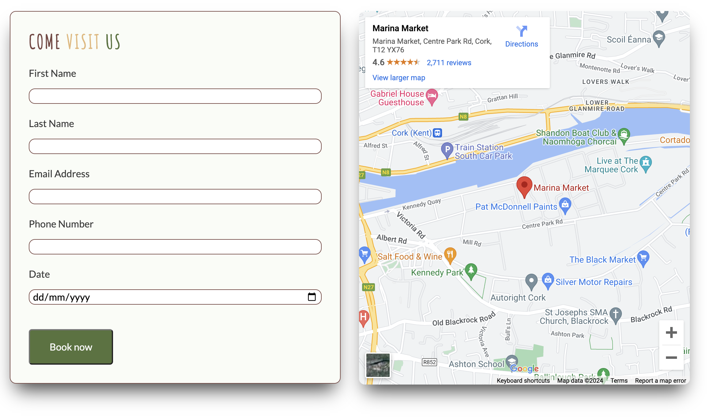

    - The form allows customers to book a reservation on a specific date directly from the business' website.
    
    - The map displays a Google map of the business' geographical location. This allows the customers to easily find the location from their devices.

[Back to top ⇧](#las-tacos)

